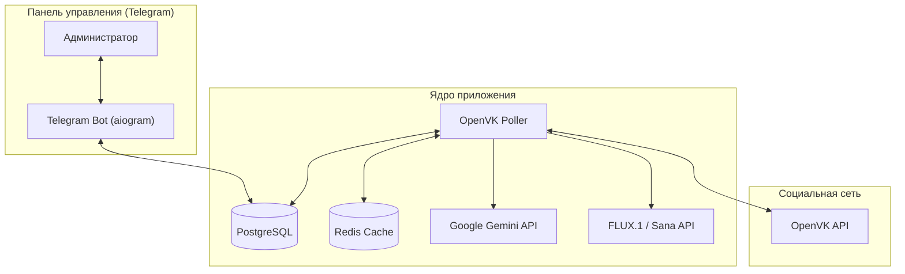

# OpenVK AI Agent


Интеллектуальный агент-автоответчик для социальной сети OpenVK на базе Google Gemini API с поддержкой генерации изображений, системой автоматических подарков и удобным Telegram-интерфейсом управления.

---

## Ключевые возможности

- **Многопоточный опрос (Polling):**
  - Мониторинг входящих уведомлений (`notifications.get`) в реальном времени.
  - Резервный опрос активных стен (`wall.get`) для обхода ограничений API.
  - Обработка личных сообщений (`messages.getConversations` с fallback на `messages.getDialogs`).
  - Периодическое комментирование популярных постов из глобальной ленты новостей.
- **Генерация контента:**
  - Контекстные текстовые ответы с помощью Google Gemini.
  - Интеллектуальная генерация изображений: автоматический парсинг запросов на рисование и отправка изображений (FLUX.1 через HuggingFace/Pollinations или Sana в качестве fallback).
- **Интерактивные механики:**
  - Автоматическое добавление в друзья входящих заявок.
  - Отправка бесплатных подарков со случайными анекдотами (новым и старым друзьям без спама — по одному за цикл).
  - Динамический пост статистики на стене бота (топ активных пользователей, счетчики ответов и лайков) с автообновлением и пересозданием при блокировках.
- **Отказоустойчивость:**
  - **Circuit Breaker:** защита от каскадных сбоев при падении серверов OpenVK (автоматическая пауза запросов на 60 секунд при серии ошибок 502/таймаутов).
  - **Rate Limiter:** жесткий контроль частоты запросов к API во избежание блокировок.
  - **Дедупликация:** строгий контроль повторных ответов через кэш в Redis.
- **Управление через Telegram:**
  - Включение/выключение бота в один клик.
  - Изменение системного промпта «на лету» без перезапуска.
  - Управление ручным черным списком и просмотр автоматического ЧС (пользователи, закрывшие профиль).
  - Интерактивный просмотр статистики и статуса.

---

## Архитектура системы



Подробное описание каждого компонента, логики дедупликации и работы Circuit Breaker приведено в файле [docs/architecture.md](./docs/architecture.md).

---

## Стек технологий

| Категория | Технология | Версия | Назначение |
| --- | --- | --- | --- |
| Язык разработки | Python | 3.11 | Основной язык реализации проекта |
| ИИ Модели (Текст) | Google Gemini | 3.6-flash / lite | Генерация интеллектуальных ответов |
| ИИ Модели (Изображения) | FLUX.1, Sana | latest | fallback-генерация картинок по запросу |
| Telegram API | aiogram | 3.x | Панель управления и мониторинга для администратора |
| База данных | PostgreSQL, SQLAlchemy | 15 / 2.0 | Хранение настроек, статистики и данных ЧС |
| Кэширование | Redis | 5.x | Блокировки, дедупликация и временное хранение данных |
| HTTP Клиент | httpx | 0.27 | Асинхронные запросы к инстансам OpenVK и ИИ-провайдерам |
| Контейнеризация | Docker, Docker Compose | 24.x+ | Оркестрация и развертывание приложения |

---

## Требования

- Docker и Docker Compose (v24.x+)
- Ключ Google Gemini API
- Токен и ID аккаунта в OpenVK
- Токен Telegram-бота (созданный через `@BotFather`)

---

## Быстрый старт

> Перед началом работы убедитесь, что на вашем сервере запущен Docker daemon и свободны порты для PostgreSQL и Redis.

**1. Клонируйте репозиторий и перейдите в его директорию:**
```bash
git clone https://github.com/booowieee/ovk-ai-agent.git
cd ovk-ai-agent
```

**2. Создайте файл конфигурации `.env` на основе примера:**
```bash
cp .env.example .env
```

**3. Заполните переменные окружения в `.env` (см. раздел [Конфигурация](#конфигурация-env)).**

**4. Запустите стек через Docker Compose в фоновом режиме:**
```bash
docker compose up -d --build
```

---

## Конфигурация (.env)

| Переменная | Описание | Пример |
| --- | --- | --- |
| `BOT_TOKEN` | Токен Telegram-бота для управления агентом | `123456:ABC-DEF...` |
| `ADMIN_TELEGRAM_ID` | Ваш числовой ID в Telegram для авторизации | `987654321` |
| `GEMINI_API_KEY` | Токен доступа к Google Gemini API | `AIzaSy...` |
| `GEMINI_MODEL` | Модель Gemini для генерации ответов | `gemini-flash-lite-latest` |
| `OVK_INSTANCE_URL` | Адрес инстанса социальной сети OpenVK | `https://openvk.org` |
| `OVK_ACCESS_TOKEN` | Токен авторизации пользователя OpenVK | `ovk_tok_...` |
| `OVK_USER_ID` | Числовой ID вашего профиля в OpenVK | `12345` |
| `OVK_STATS_POST_ID` | ID закрепленного поста для вывода статистики (необязательно) | `43657_44` |
| `DATABASE_URL` | Строка подключения к PostgreSQL | `postgresql+asyncpg://...` |
| `REDIS_URL` | Строка подключения к Redis | `redis://redis:6379/0` |
| `HUGGINGFACE_API_KEY` | Токен HF для качественной генерации картинок (необязательно) | `hf_...` |
| `POLLINATIONS_API_KEY` | Токен Pollinations для генерации картинок (необязательно) | `pol_...` |

### Как получить токен авторизации OpenVK
1. Перейдите по ссылке для авторизации приложения (при необходимости замените `client_id`):
   `https://oauth.vk.com/authorize?client_id=2685111&redirect_uri=https://oauth.vk.com/blank.html&response_type=token&scope=wall,notifications,offline,friends,messages`
2. Разрешите доступ к вашему аккаунту.
3. Скопируйте значение `access_token` из адресной строки перенаправленной (пустой) страницы.

---

## Структура проекта

```text
├── src/
│   ├── config/          # Конфигурация приложения и парсинг .env
│   ├── control_bot/     # Telegram-бот управления (aiogram)
│   │   ├── handlers/    # Обработчики команд и инлайн-кнопок
│   │   └── keyboards/   # Клавиатуры интерфейса
│   ├── core/            # Ядро: Circuit Breaker, Rate Limiter, App State
│   ├── database/        # Настройка SQLAlchemy и описание моделей DB
│   ├── openvk/          # Клиент OpenVK, парсеры упоминаний, поллер и респондер
│   ├── repositories/    # Слой доступа к данным (настройки, ЧС, статистика)
│   ├── services/        # Интеграция с ИИ (генерация текстов и изображений)
│   └── utils/           # Логирование, корректное завершение работы (graceful shutdown)
├── Dockerfile           # Описание сборки контейнера приложения
├── docker-compose.yml   # Конфигурация запуска сервисов (App, DB, Redis)
├── main.py              # Точка входа в приложение
└── requirements.txt     # Зависимости Python проекта
```

---

## Управление и команды

Управление агентом осуществляется через Telegram-бота. Доступ в интерфейс имеет только пользователь, чей ID указан в `ADMIN_TELEGRAM_ID`.

### Кнопки интерфейса:
- **AI Бот: Включен/Выключен** — полная остановка/запуск автоматических ответов в OpenVK.
- **Генерация картинок: Включена/Выключена** — переключение режима создания AI-артов по запросам пользователей.
- **Настройки OVK** — просмотр текущего адреса инстанса, ID бота и статуса токена.
- **Изменение промпта** — мгновенное обновление системной инструкции для Gemini.
- **Чёрный список** — добавление/удаление пользователей из ручного ЧС, просмотр авто-ЧС (кто заблокировал бота).
- **Статистика** — просмотр логов активности, топ-5 собеседников и генераторов картинок.
- **Аварийный Стоп** — экстренная приостановка всех фоновых задач опроса сети.

---

## Решение проблем

При возникновении ошибок сети, лимитов запросов к API или проблем с генерацией изображений обратитесь к файлу [docs/troubleshooting.md](./docs/troubleshooting.md).

---

## Лицензия

Проект распространяется под лицензией MIT. Подробности см. в файле [LICENSE](LICENSE).
