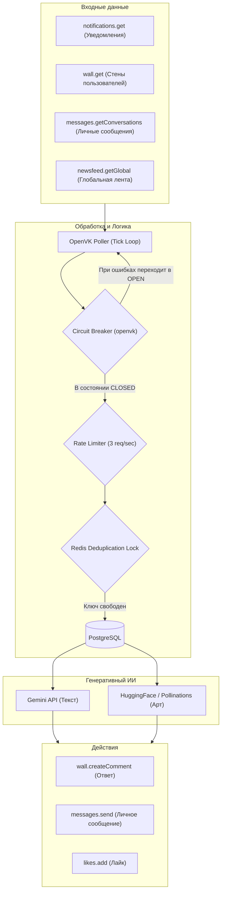

# Архитектура OpenVK AI Agent

В данном документе приведено детальное описание архитектуры, внутренних компонентов, схемы базы данных и логики отказоустойчивости ИИ-агента.

---

## Общая схема взаимодействия

Агент построен на базе асинхронного Event-Driven подхода. Жизненным циклом управляет поллер (`OpenVKPoller`), который распределяет задачи по нескольким независимым фоновым сопрограммам (coroutines).

---

## Компоненты ядра

### 1. OpenVKPoller ([`src/openvk/poller.py`](../src/openvk/poller.py))
Основной цикл опроса. Выполняет периодические задачи:
* **Уведомления (Раз в тик):** Запрашивает до 100 последних уведомлений. Во избежание OpenVK API Rate Limit (`Error 29`), отметка о прочтении (`notifications.markAsViewed`) вызывается не чаще одного раза в 120 секунд.
* **Мониторинг стен (Раз в тик):** Опрашивает список из 5 последних активных внешних стен (`_monitored_walls`) и стену самого бота на наличие новых постов и комментариев с упоминанием.
* **Личные сообщения (Раз в тик):** Обрабатывает ЛС. Пытается вызвать `messages.getConversations`, в случае недоступности метода автоматически откатывается на `messages.getDialogs`.
* **Глобальная лента (Раз в 10 минут):** Запрашивает `newsfeed.getGlobal` и комментирует один случайный пост, выражая мнение в тему, после чего ставит лайк.
* **Авто-друзья (Раз в минуту):** Принимает входящие заявки в друзья через `friends.add`, отправляет новому другу бесплатный подарок с анекдотом и сохраняет имя друга в Redis для вывода в статистику.
* **Обновление статистики (Раз в 10 минут):** Обновляет и перезаписывает закрепленный пост со статистикой на стене бота. Если пост был удален или заблокирован пользователем, бот автоматически создает новый, закрепляет его и обновляет ID в Redis.

### 2. Circuit Breaker ([`src/core/circuit_breaker.py`](../src/core/circuit_breaker.py))
Предохранитель, защищающий приложение от зависания при падении серверов OpenVK:
* **CLOSED (Замкнут):** Нормальный режим работы. Запросы проходят к серверу.
* **OPEN (Разомкнут):** Активируется после 5 ошибок сервера подряд (например, `502 Bad Gateway` или таймаутов). Все запросы мгновенно блокируются с выбросом `CircuitBreakerOpen` без обращения по сети. Cooldown — 60 секунд.
* **HALF-OPEN (Полуразомкнут):** По истечении cooldown бот совершает один проверочный запрос. В случае успеха предохранитель закрывается (`CLOSED`), при неудаче — снова открывается на 60 секунд.

### 3. Rate Limiter ([`src/core/rate_limiter.py`](../src/core/rate_limiter.py))
Реализует алгоритм Token Bucket для ограничения частоты запросов к API. По умолчанию настроен на максимум **3 запроса в секунду** во избежание лимитов OpenVK.

### 4. Redis Lock ([`src/openvk/responder.py`](../src/openvk/responder.py))
Обеспечивает строгую дедупликацию ответов:
* Перед обработкой события создается временный ключ блокировки `ovk:lock:{mention_key}` в Redis со значением `processing` и TTL 1 час.
* Если ключ уже существует, событие полностью пропускается.
* После успешного ответа ключ обновляется на `completed` с TTL 7 дней.
* При ошибках генерации или сети ключ удаляется (`release_lock`), позволяя повторить попытку на следующем тике.

---

## Схема базы данных (PostgreSQL)

Для работы с базой используется асинхронный движок `SQLAlchemy` (`asyncpg`).

### 1. Таблица настроек `system_settings`
Хранит конфигурацию бота, изменяемую через Telegram-панель:
* `id` (primary key, default=1)
* `is_enabled` (boolean): включен/выключен автоответчик.
* `system_prompt` (text): текущий промпт для Gemini.
* `openvk_instance_url` (text): URL инстанса OpenVK.
* `openvk_token` (text): токен доступа.
* `openvk_user_id` (integer): ID страницы бота.
* `poll_interval` (integer): интервал тика опроса в секундах.

### 2. Таблицы черных списков
* `blacklisted_users`: Ручной черный список. Содержит `vk_id` (integer) и `reason` (text).
* `auto_blocked_users`: Пользователи, у которых закрыт профиль или комменты. Содержит `vk_id` (integer). Заполняется ботом автоматически при получении HTTP-ошибок (400, 401, 403, 404) при попытке ответить.

### 3. Таблицы статистики
* `user_activities`: Статистика пользователей. Хранит `vk_id`, `first_name`, `last_name`, `text_requests_count` (число запросов), `image_requests_count` (число картинок), `last_active_at`.
* `system_stats`: Глобальная статистика. Хранит счетчики текстовых генераций, картинок (в разбивке по FLUX и Sana) и поставленных лайков.
